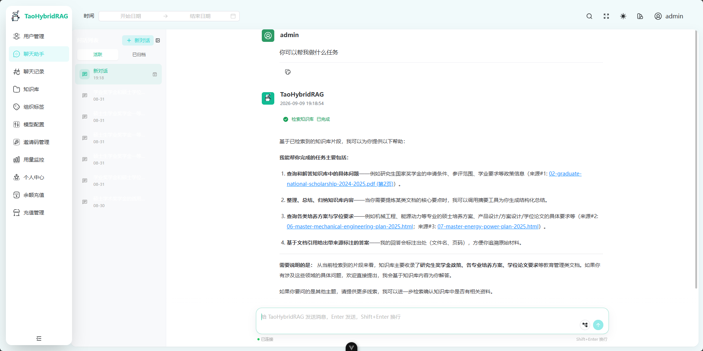
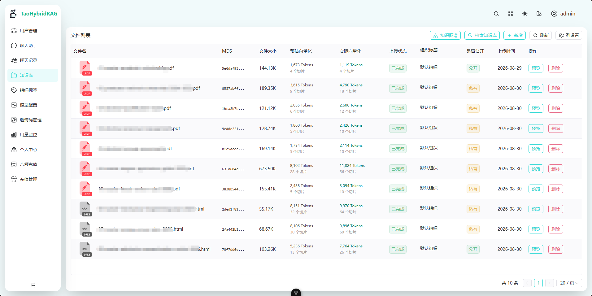
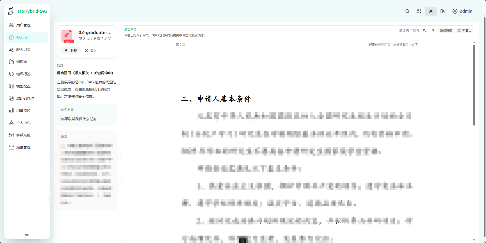
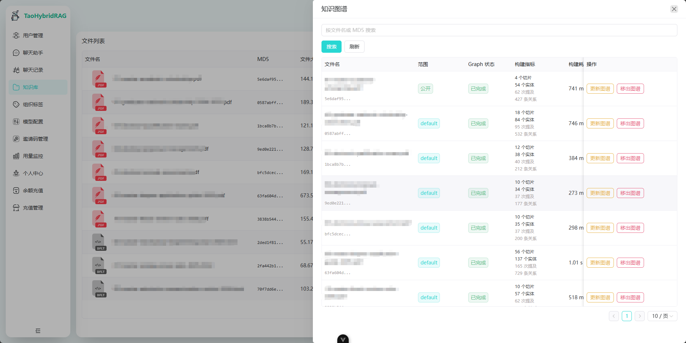

# TaoHybridRAG

English | [简体中文](README_cn.md)

TaoHybridRAG is an enterprise-oriented knowledge-base question-answering system built with Java and Vue. It provides asynchronous document ingestion, hybrid retrieval, permission-aware evidence selection, ReAct-style tool calls, streaming chat, and traceable citations.

The project is designed as an inspectable RAG engineering baseline: retrieval behavior can be evaluated, GraphRAG is optional and observable, and failures in experimental Graph features do not block the primary Hybrid retrieval path.

## Preview

### Knowledge-grounded chat with citations



### Knowledge-base ingestion and status



### Citation and source-document preview



### Graph knowledge management



## Highlights

- **Document ingestion**: upload, asynchronous parsing, semantic chunking, embedding, indexing, and processing-status tracking.
- **Hybrid retrieval**: Elasticsearch KNN vector search and BM25 keyword retrieval with a measurable evaluation path.
- **Evidence-based answers**: source files, chunks, and page information are mapped back to generated answers.
- **ReAct-style tools**: the chat workflow can call knowledge search, summarization, feedback, knowledge-base statistics, and optional Graph tools.
- **Experimental GraphRAG**: MySQL-backed entities, mentions, relations, build state, permission metadata, and cross-document retrieval.
- **Multi-tenant access control**: private/public documents, user ownership, organization tags, and role-aware management.
- **Streaming interaction**: WebSocket chat with reconnect handling and conversation history.
- **Configurable AI providers**: configurable LLM and embedding endpoints instead of credentials embedded in source code.

## Architecture

```text
Browser / Vue 3
       │ HTTP + WebSocket
       ▼
Spring Boot API and chat workflow
       ├── MySQL ───────── users, files, conversations, Graph data
       ├── Redis ───────── session, cache, short-lived chat context
       ├── Kafka ───────── asynchronous document-processing tasks
       ├── MinIO ───────── uploaded source files
       ├── Elasticsearch ─ BM25 + vector retrieval
       └── LLM / Embedding providers
```

The backend currently uses `com.yizhaoqi.smartpai` as its main Java namespace. This is the namespace used by the current codebase, not a dependency on a separate product.

## Technology Stack

| Area | Technology |
| --- | --- |
| Backend | Java 17, Spring Boot 3.4.2, Maven, Spring Security, Spring Data JPA, WebFlux |
| Frontend | Vue 3, TypeScript, Vite, Naive UI, Pinia, Vue Router, UnoCSS |
| Database and cache | MySQL 8, Redis 7 |
| Retrieval | Elasticsearch 8.10.4, BM25, dense-vector KNN |
| Async processing | Apache Kafka |
| Object storage | MinIO |
| Document parsing | Apache Tika 2.9.1, optional LiteParse |
| AI integration | Configurable LLM and embedding providers |

## Repository Layout

```text
TaoHybridRAG/
├── src/main/java/com/yizhaoqi/smartpai/
│   ├── client/          # External AI and service clients
│   ├── config/          # Security and application configuration
│   ├── consumer/        # Kafka consumers
│   ├── controller/      # REST endpoints
│   ├── entity/          # Persistence entities
│   ├── handler/         # WebSocket handlers
│   ├── repository/      # Data-access layer
│   └── service/         # Document, retrieval, chat, and Graph services
├── frontend/            # Vue 3 frontend
├── docs/                # Deployment, evaluation, and benchmark documents
└── scripts/             # Reproducible local utilities
```

## Prerequisites

- Java 17
- Maven 3.9+
- Node.js 18.20+
- pnpm 8.7+
- Docker with Docker Compose, or independently managed MySQL, Redis, Kafka, MinIO, and Elasticsearch
- An LLM API and an embedding API compatible with the configured endpoints

The supplied Compose stack allocates approximately 1 GiB of heap to Elasticsearch. Make sure Docker has enough memory before starting all services.

## Quick Start

### 1. Clone the repository

```bash
git clone https://github.com/liangbantaozi/taohybrid-rag.git
cd taohybrid-rag
```

### 2. Prepare application configuration

Copy the public template to a local `.env` file:

```powershell
Copy-Item .env.example .env
```

Linux or macOS:

```bash
cp .env.example .env
```

Review every value before startup. At minimum, configure service connections, a newly generated `JWT_SECRET_KEY`, administrator bootstrap policy, LLM and embedding providers, allowed origins, and registration mode.

Values in `.env.example` are development examples only. Never reuse example passwords or secrets in an Internet-facing deployment. The local `.env` file is ignored by Git.

### 3. Start isolated infrastructure

The isolated Compose file requires four passwords. Set them in the current shell or in your own ignored environment file:

```powershell
$env:TAO_HYBRID_MYSQL_ROOT_PASSWORD = '<choose-a-local-password>'
$env:TAO_HYBRID_REDIS_PASSWORD = '<choose-a-local-password>'
$env:TAO_HYBRID_MINIO_ROOT_PASSWORD = '<choose-a-local-password>'
$env:TAO_HYBRID_ELASTIC_PASSWORD = '<choose-a-local-password>'

docker compose -f .\docs\docker-compose.tao-hybrid.yaml -p tao-hybrid up -d
```

The Compose stack exposes these host ports:

| Service | Host port |
| --- | ---: |
| MySQL | 3307 |
| Redis | 6380 |
| Kafka | 19092 |
| MinIO API / Console | 29000 / 29001 |
| Elasticsearch | 9201 |

Update the corresponding values in `.env` to use these ports. Elasticsearch in this Compose stack uses `http`, not `https`. Application-side passwords must match the values passed to Compose.

Check service state:

```powershell
docker compose -f .\docs\docker-compose.tao-hybrid.yaml -p tao-hybrid ps
```

### 4. Start the backend

```powershell
mvn spring-boot:run
```

The backend runs on `http://localhost:8082` by default and reads the root `.env` through the project's environment post-processor.

### 5. Start the frontend

```powershell
Set-Location frontend
pnpm install
pnpm dev
```

Open `http://localhost:9528`. The versioned development environment proxies API calls to `http://localhost:8082/api/v1`.

### 6. Bootstrap the first administrator

For an empty database, temporarily enable the administrator bootstrap settings in `.env`, start the backend once, sign in, and then disable bootstrap again. Do not keep bootstrap enabled in a public deployment.

## Basic Verification

1. Sign in and upload a small TXT, HTML, or PDF document.
2. Wait until parsing and vectorization show a completed state.
3. Ask a question whose answer exists in that document.
4. Confirm that the answer contains a source citation and that its source preview opens.
5. Disable Graph references and verify that normal Hybrid retrieval still works.
6. If Graph is enabled for selected documents, verify its build state and permission scope separately.

## Development Checks

```bash
# Backend compilation and tests
mvn -q -DskipTests compile
mvn test

# Frontend type checking and linting
cd frontend
pnpm typecheck
pnpm lint
```

## Evaluation Support

The project includes evaluation code for BM25, vector, Hybrid, and optional Graph retrieval strategies, together with upload benchmarking utilities. Results depend on the selected corpus, model configuration, hardware, network, and service environment, so this first public version does not publish local measurements or generated result files. Run the evaluations in your own environment and report the dataset, parameters, and runtime conditions together with any result.

## GraphRAG Status

GraphRAG is currently an experimental, opt-in supplement:

- Graph construction is enabled per document by an administrator.
- Entities, mentions, and relations keep their source file/chunk and permission metadata.
- Query routing is observable and covered by evaluation fields.
- A Graph timeout, failure, or empty result falls back to the normal Hybrid workflow.
- Rule-based extraction has known limitations for Chinese entity boundaries, synonym normalization, and noisy co-occurrence relations.

The planned direction is to preserve the complete Hybrid TopK evidence and append a small, permission-filtered Graph supplement instead of allowing Graph results to displace the main evidence.

## Security Notes

- Never commit `.env`, provider keys, real user documents, chat exports, database dumps, or production logs.
- Replace development credentials before exposing any service to the Internet.
- Restrict allowed origins and registration policy in production.
- Keep infrastructure services behind an appropriate network boundary.
- Review licenses and personally identifiable information before adding evaluation corpora to Git.

## Known Limitations

- The Kafka Compose image currently uses a `latest` tag and should be pinned for a fully reproducible release.
- LiteParse is optional and requires a separately available local command/runtime.
- The first retrieval dataset is small and lexically easy; difficult and cross-document results must be reported separately.
- Graph extraction is rule-based and experimental.
- Production deployment requires environment-specific security hardening, backups, monitoring, and resource sizing.

## License

This project is licensed under the [Apache License 2.0](LICENSE).
